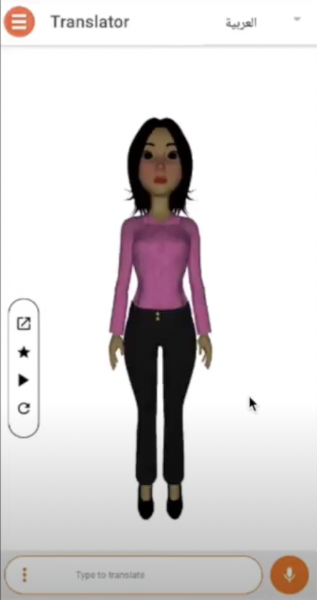

# Signy: a Mobile App for Arabic Speech and Text to Moroccan Sign Language 

In the speech–to–text module, the user can choose between the **Modern Standard Arabic** language and the French language. The user can long-press on the microphone and speak or type a text message. The voice message will be transcribed to a text message using the google cloud API services. In the text-to-gloss module, the transcribed or typed text message is transcribed to a gloss. This module is not implemented yet. Finally, in the gloss–to-sign animation module, the avatar **Samia** is animated using Unity Engine.

